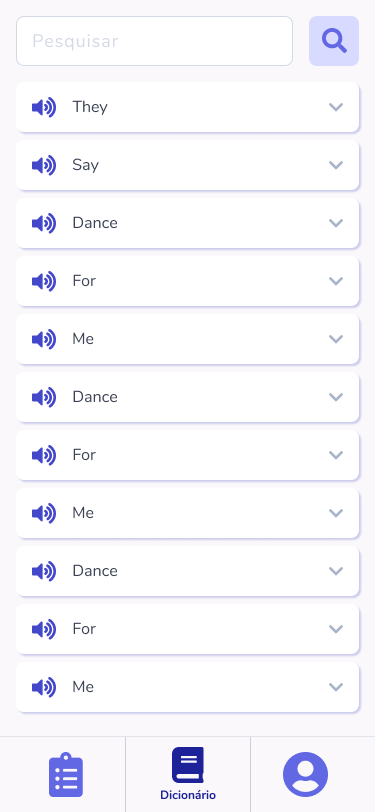

<h1 align="center">
  <a href="https://github.com/csorlandi/english-course">
    
  </a>
</h1>

<h2 align="center">
  English Course App
</h2>

<p align="center">O English Course App é um projeto que inicialente seria feito como Freelancing, mas em consenso com o cliente (que seria o proprietário da aplicação) decidiu-se liberá-lo para ser desenvolvido completamente durante as Streams (<a href="https://twitch.tv/csorlandi" target="_blank">link para acompanhar</a>), de forma aberta e gratuita!
</p>
<p align="center">
A ideia é que na aplicação o usuário possa assistir aulas diárias de inglês. Para isso ele deve se cadastrar e/ou fazer login com Email/Senha ou usando suas Redes Sociais (Facebook ou Google). Depois da etapa de autenticação ele tem uma quantidade de aulas gratuitas para assistir até ter que fazer o Upgrade da sua conta (comprar o restante das aulas) para dar continuidade aos estudos. Ao término de cada aula serão liberadas algumas palavras, que vão para um Dicionário, no qual o usuário poderá consultar as palavras que já aprendeu em algum momento do curso. Para finalizar, será possível o usuário editar as informações do seu perfil e também visualizar um histórico das aulas já assistidas.</p>

---

<p align="center">
  
  
  
  
</p>

---

## Índice

<ul>
  <li><a href="#-instalação">Instalação</a></li>
  <li><a href="#-funcionalidades">Funcionalidades</a></li>
  <li><a href="#-contribuição">Contribuição</a></li>
  <li><a href="#-apoio">Apoio</a></li>
  <li><a href="#-licença">Licença</a></li>
</ul>

---

## 🚀 Instalação

### Pré-requisitos

- Para rodar qualquer aplicação feita em React Native você precisa configurar o Ambiente de Desenvolvimento na sua máquina.

- Configurar o ambiente é um processo complexo, por isso é recomendado seguir o Guia da Rocketseat, que atualmente é o mais completo e detalhado para fazer as configurações:

- ### [**Guia da Rocketseat**](https://react-native.rocketseat.dev/)

### Clone

- Clone esse repositório para sua máquina local:

```
https://github.com/csorlandi/english-course
```

### Setup

#### Android

- `$ react-native run-android`

#### iOS - _Apenas no MAC_

- `cd ios && pod install && cd ..`

- `react-native run-ios`

---

## 📋 Funcionalidades

### Documentação

- [ ] Trabalhando em progresso ...

### Feito com

- Core
  - [React Native](https://reactnative.dev/) - Um framework para construir aplicações nativas com React
- Navegação
  - [React Navigation](https://reactnavigation.org/) - Roteamento e navegação para aplicações em React Native
- Estilização
  - [Styled Components](https://styled-components.com/) - Usa um pouco de ES6 e CSS para estilizar suas aplicações sem estresse
- Ícones
  - [React Native Vector Icons]() - Trabalhando em progresso ...
- Comunicação HTTP
  - [Axios](https://github.com/axios/axios) - Cliente HTTP baseado em Promises para o Browser e NodeJS
- Type Checking
  - [prop-types](https://github.com/facebook/prop-types) - Verificação de tipo rm tempo de execução para React props e objetos semelhantes
- Linting
  - [ESLint](https://github.com/eslint/eslint) - Encontrar e corrigir problemas no seu código Javascript
  - [Prettier](https://prettier.io/) - O Prettier é um formatador de código opinativo
- Extra
  - [react-navigation/stack]() - Trabalhando em progresso ...
  - [react-navigation/bottom-tabs]() - Trabalhando em progresso ...
  - [babel-plugin-root-import](https://github.com/entwicklerstube/babel-plugin-root-import) - Plugin do Babel para adicionar a oportunidade de usar a importação e exigir com caminhos baseados em raiz
  - [eslint-import-resolver-babel-plugin-root-import]() - Trabalhando em progresso ...
  - [babel-eslint]() - Trabalhando em progresso ...
  - [eslint-config-prettier]() - Trabalhando em progresso ...
  - [eslint-plugin-prettier]() - Trabalhando em progresso ...
  - [eslint-config-airbnb](https://github.com/airbnb/javascript) - Uma abordagem bastante razoável para JavaScript
- More
  - For more detais about the packages, check `package.json` file...

---

## 🤔 Contribuição

> Para começar...

### Passo 1

- 🍴 Faça um Fork desse repositório!

### Passo 2

- 👯 Clone esse repositório para sua máquina local executando `git clone https://github.com/csorlandi/english-course.git`

### Passo 3

- 🎋 Crie uma branch de feature executando `git checkout -b my-feature`

### Passo 4

- ✅ Faça commit com as suas mudanças executando `git commit -m 'feat: My new feature'`;

### Passo 5

- 📌 Faça o Push para da branch executando `git push origin my-feature`;

### Passo 6

- 🔃 Crie um novo Pull Request

Depois que for feito o merge do seu Pull Request, você pode deletar a branch de feature.

---

## 📌 Apoio

Entre em contato comigo em um dos seguintes lugares!

- Twitch TV em [/csorlandi](https://twitch.tv/csorlandi)
- Twitter em [@csorlandi](https://twitter.com/csorlandi)
- Instagram em [@cs.orlandi](https://www.instagram.com/cs.orlandi/)
- Youtube em [Claudio Orlandi](https://www.youtube.com/claudiosorlandi)
- Linkedin em [Claudio Orlandi](https://www.linkedin.com/in/csorlandi/)

---

## 📝 Licença


Este projeto está licenciado sob a licença MIT - consulte o arquivo [LICENSE](LICENSE) para obter detalhes.

---

Feito com ♥ Aproveite!
